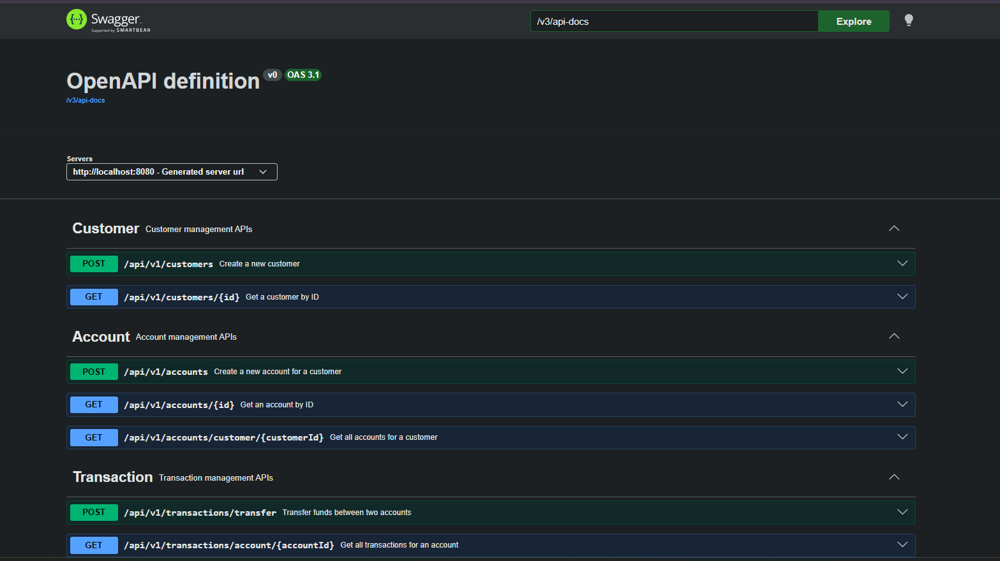
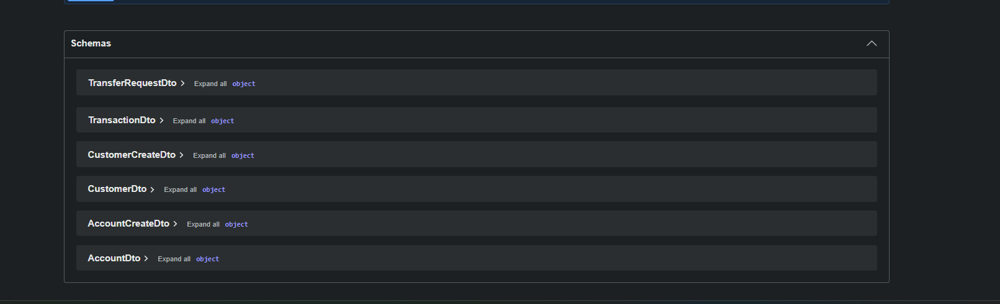

# spring-boot-banking-api

[](https://adoptium.net/)
[](https://spring.io/projects/spring-boot)
[](https://flywaydb.org/)
[](https://www.mysql.com/)
[](https://github.com/sudha-chinnaiyan/spring-boot-banking-api/actions)

A robust, enterprise-grade Spring Boot 4 RESTful Banking API designed to demonstrate production-ready patterns for transactional consistency, ACID properties, validation rules, centralized error reporting, and optimistic concurrency controls.

This project represents a highly cohesive REST backend engineered under a clean 3-tier architecture, complete with containerization, Flyway database schema migrations, and CI workflows.

---

## 🚀 Business Problem & Use Case

Modern retail banking backends must support concurrent operations while maintaining strict data integrity. Key challenges include:
*   **Preventing Lost Updates**: Multiple concurrent updates to the same account balance must not cause race conditions.
*   **Transaction Atomicity**: Money must never be deducted from a source account without being credited to a destination account.
*   **Input Validation & Integrity**: Rejecting improper requests (e.g. self-transfers, negative deposits, invalid email formats) at the API boundary.

This API solves these challenges using declarative transactions (`@Transactional`), JPA optimistic locking (`@Version`), and validation frameworks (`jakarta.validation`).

---

## 🛠️ Technology Stack

*   **Runtime & Language**: Java 17 (Eclipse Temurin JDK/JRE)
*   **Framework**: Spring Boot 4.1.1
    *   *Spring Data JPA* (Hibernate ORM)
    *   *Spring Security* (Configured to expose REST endpoints while disabling CSRF)
    *   *Spring Validation* (`jakarta.validation-api`)
*   **Database Management**: MySQL 8.0 (Production) | H2 Database (Unit/Integration Testing)
*   **Schema Migration**: Flyway 12.4.0
*   **Containerization**: Docker Compose & Multi-stage Dockerfile
*   **API Specification**: OpenAPI 3.0 / Swagger UI (using Springdoc OpenAPi 2.5.0)
*   **CI Pipeline**: GitHub Actions

---

## 📐 Architecture & Domain Model

The application follows a clean 3-tier architectural pattern:

```
[Client / Swagger] ──(HTTP JSON)──> [Controller Layer] 
                                            │
                                            ▼ (DTOs)
                                    [Service Layer] (Business Logic & @Transactional)
                                            │
                                            ▼ (Entities)
                                    [Repository Layer] (Spring Data JPA Repositories)
                                            │
                                            ▼
                                     [Database (MySQL)]
```

### Domain Schema (ER Diagram representation)

1.  **Customer**: Represents a bank customer.
    *   `id` (BIGINT, PK, Auto-Increment)
    *   `firstName` (VARCHAR, Not Null)
    *   `lastName` (VARCHAR, Not Null)
    *   `email` (VARCHAR, Not Null, Unique)
    *   `phone` (VARCHAR, Not Null)
2.  **Account**: Financial account belonging to a customer. Uses version-based optimistic locking.
    *   `id` (BIGINT, PK, Auto-Increment)
    *   `accountNumber` (VARCHAR, Not Null, Unique)
    *   `accountType` (VARCHAR/Enum: `SAVINGS`, `CURRENT`, Not Null)
    *   `balance` (DECIMAL(19,4), Not Null)
    *   `status` (VARCHAR/Enum: `ACTIVE`, `INACTIVE`, `BLOCKED`, `CLOSED`, Not Null)
    *   `customerId` (BIGINT, FK referencing `Customer.id`, Not Null)
    *   `version` (BIGINT, Optimistic Lock Counter)
3.  **Transaction**: Immutable ledger entries recording transfer events.
    *   `id` (BIGINT, PK, Auto-Increment)
    *   `transactionReference` (VARCHAR, Unique, UUID format)
    *   `transactionType` (VARCHAR/Enum: `TRANSFER`, `DEPOSIT`, `WITHDRAWAL`, Not Null)
    *   `amount` (DECIMAL(19,4), Not Null)
    *   `status` (VARCHAR/Enum: `COMPLETED`, `FAILED`, `PENDING`, Not Null)
    *   `sourceAccountId` (BIGINT, FK referencing `Account.id`)
    *   `destinationAccountId` (BIGINT, FK referencing `Account.id`)

---

## 📊 API Documentation & Endpoints

Interactive Swagger documentation is available once the application runs at:
*   **Swagger UI**: [http://localhost:8080/swagger-ui/index.html](http://localhost:8080/swagger-ui/index.html)

### Endpoint Reference Table

| HTTP Method | Endpoint | Purpose | Request Body | Success Code | Common Failure Codes |
| :--- | :--- | :--- | :--- | :--- | :--- |
| **POST** | `/api/v1/customers` | Register a new customer profile | `CustomerCreateDto` | `201 Created` | `400 Bad Request` (Email already exists / Validation failure) |
| **GET** | `/api/v1/customers/{id}` | Retrieve customer profile by ID | None | `200 OK` | `404 Not Found` |
| **POST** | `/api/v1/accounts` | Create a bank account for a customer | `AccountCreateDto` | `201 Created` | `400 Bad Request`, `404 Not Found` |
| **GET** | `/api/v1/accounts/{id}` | Retrieve account details by ID | None | `200 OK` | `404 Not Found` |
| **GET** | `/api/v1/accounts/customer/{customerId}` | Retrieve all accounts for a customer | None | `200 OK` | None (Returns empty array if no accounts) |
| **POST** | `/api/v1/transactions/transfer` | Execute an atomic money transfer | `TransferRequestDto` | `200 OK` | `400 Bad Request` (Self-transfer / Insufficient funds), `403 Forbidden` (Account Blocked), `404 Not Found`, `409 Conflict` (Optimistic lock conflict) |
| **GET** | `/api/v1/transactions/account/{accountId}` | Retrieve transaction history of an account | None | `200 OK` | None (Returns empty array if no transactions) |

---

## 📷 Screenshots / API Demo

Below is the visual overview of the API schemas and execution flow using the actual Swagger UI documentation:

### Swagger UI API Schemas


### Swagger UI API Execution


---

## 💡 Key Engineering Decisions

### 🔒 Optimistic Concurrency Control
Under heavy load, two operations might attempt to deduct or deposit to the same account at the same instant. This project uses **JPA Optimistic Locking** on the `Account` entity via a `@Version` attribute. If a version mismatch is detected on commit, Hibernate throws an `ObjectOptimisticLockingFailureException`. The application translates this to an HTTP `409 Conflict` status with an instructions message so that clients can implement a safe retry loop.

### 🧩 Declarative ACID Boundaries
All money transfer steps (fetching source/destination, verifying balances, updating records, creating ledger entries) are executed inside a single database transaction using Spring's declarative `@Transactional` annotation. If any step fails, the entire database transaction is rolled back, preventing dangling state.

### 🛡️ REST Security Configuration
The application is pre-packaged with a customized `SecurityConfig` to facilitate API-first development and validation testing:
*   CSRF protection is disabled (`.csrf(disable)`) for standard stateless REST architecture.
*   Path matches for `/api/v1/**` and the Swagger specification (`/v3/api-docs/**`, `/swagger-ui/**`, `/swagger-ui.html`) are set to `permitAll()` to simplify local integration and review.

### 🎯 Strict Entity/DTO Isolation
Database entities (`Customer`, `Account`, `Transaction`) never escape the Service Layer. API inputs and outputs use lightweight Data Transfer Objects (DTOs), enforcing field-level validation at the controller boundary and keeping internal table schemas decoupled from external interfaces.

### 🧪 Error Handling (RFC 7807)
We leverage standard HTTP `ProblemDetail` structures to return descriptive error responses when exceptions occur:
*   Includes exact validation errors inside a custom `invalidParams` metadata block.
*   Enforces standardized error titles, HTTP states, and documentation-pointing URIs.

---

## 🐳 Docker Setup

### Prerequisites
*   [Docker Desktop](https://www.docker.com/products/docker-desktop/) or Docker Engine installed on your host.

The production setup uses a **Multi-Stage Dockerfile** to build the artifact using a lightweight Maven builder container (`eclipse-temurin:17-jdk`) and running the application inside a slim runtime container (`eclipse-temurin:17-jre-alpine`).

To start the database and API services:

```bash
# Start MySQL 8.0 and banking-api services in detached mode
docker compose up -d

# Check startup status
docker compose ps

# View API logs
docker logs banking_api -f
```

To tear down services:
```bash
docker compose down
```

---

## 🧪 Testing and CI

Tests use **H2 Database** for isolated environment execution.

### Run Local Tests
Run the Maven test suite using the Maven wrapper:

```bash
# Windows
.\mvnw.cmd clean verify

# Linux/macOS
./mvnw clean verify
```

### GitHub Actions CI
Every commit pushed or pull request opened against the `main` branch triggers the GitHub CI pipeline:
1.  Spawns a clean `ubuntu-latest` execution container.
2.  Sets up JDK 17 (Temurin distribution) with cached Maven dependencies.
3.  Executes `./mvnw clean verify` to ensure unit tests, schema rules, and builds are fully functional.

---

## 📈 Future Architecture Enhancements
1.  **Stateless JWT Authentication**: Secure endpoints using stateless token-based authorization instead of permissive request rules.
2.  **Concurrency Retries**: Use Spring Retry (`@Retryable`) to catch `409 Conflict` optimistic locking errors and automatically retry the transaction.
3.  **Distributed Caching**: Implement Redis caching for read-heavy query endpoints such as `/api/v1/transactions/account/{accountId}`.
